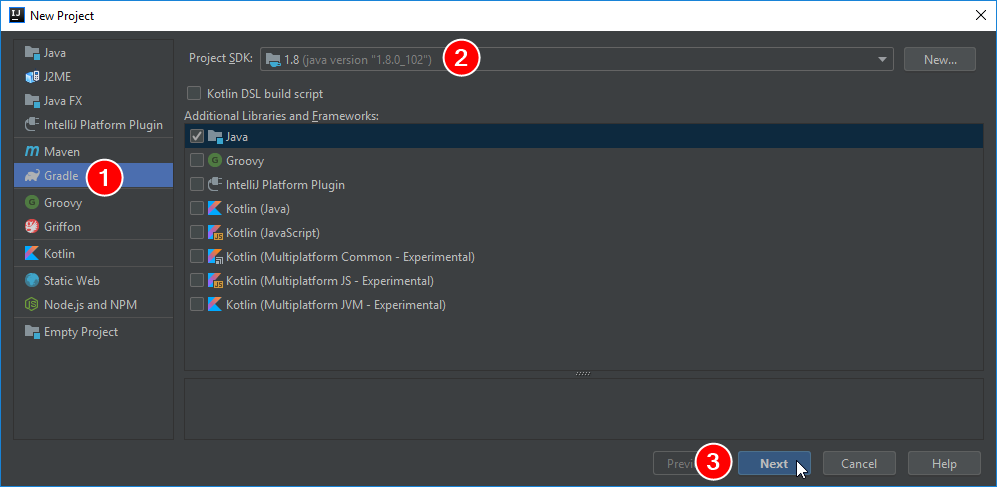
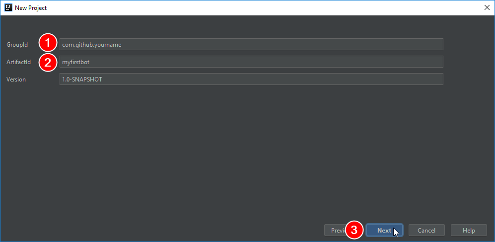
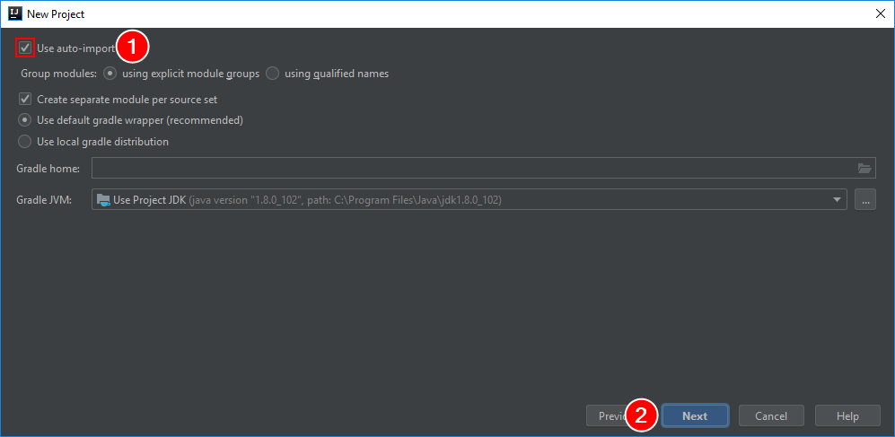
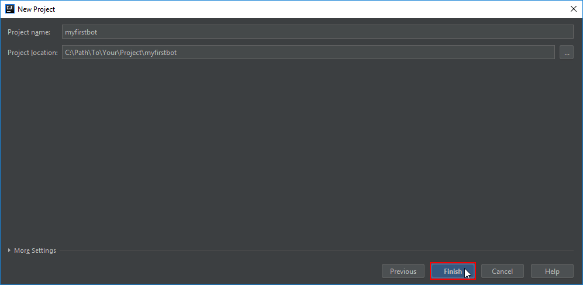
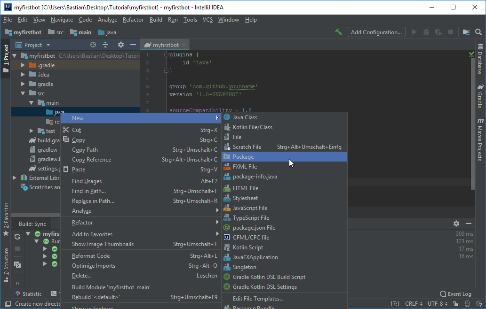
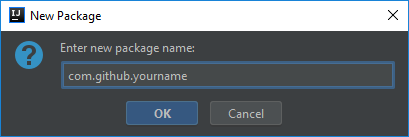
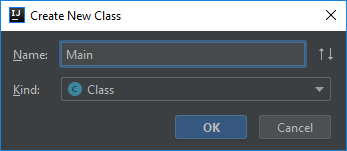
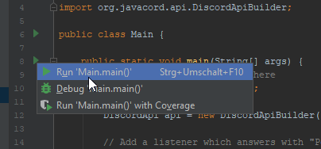

# IntelliJ + Gradle

This tutorial provides a beginner-friendly click by click guide to set up Javacord with Intellij and Gradle.
If you are already familiar with IntelliJ and Gradle, you can just see the artifact locations at [Download / Installation](/wiki/getting-started/download-installation.md).

## :wrench: Setup

#### **1.** Start IntelliJ

#### **2.** Create a new project (`File` -> `New` -> `Project`)


#### **3.** Select `Gradle`

#### **4.** Make sure to select a SDK which is 1.8 (or greater)

#### **5.** Click `Next`



#### **6.** Enter a group id (e.g. `com.github.yourname`)

You can choose whatever you want

#### **7.** Enter an artifact id (e.g. `myfirstbot`)

You can choose whatever you want

#### **8.** Click `Next`



#### **9.** Check `Use auto-import`

#### **10.** Click `Next`



#### **11.** Click `Finish`



#### **12.** Locate the `build.gradle` file and open it


#### **12.** Add the Javacord dependency. Your `build.gradle` file should now look like this
```groovy
plugins {
    id 'java'
}

group 'com.github.yourname'
version '1.0-SNAPSHOT'

sourceCompatibility = 1.8

repositories {
    mavenCentral()
}

dependencies {
    implementation 'org.javacord:javacord:${latest-version}'
}
```

#### **13.** Create a new package in the `src/main/java` folder




#### **14.** Create a new class inside this package




#### **15.** You can now start coding!

Example code:
```java
package com.github.yourname;

import org.javacord.api.DiscordApi;
import org.javacord.api.DiscordApiBuilder;

public class Main {

    public static void main(String[] args) {
        // Insert your bot's token here
        String token = "your token";

        DiscordApi api = new DiscordApiBuilder().setToken(token).login().join();

        // Add a listener which answers with "Pong!" if someone writes "!ping"
        api.addMessageCreateListener(event -> {
            if (event.getMessageContent().equalsIgnoreCase("!ping")) {
                event.getChannel().sendMessage("Pong!");
            }
        });

        // Print the invite url of your bot
        System.out.println("You can invite the bot by using the following url: " + api.createBotInvite());
    }

}
```

## :running_woman: Run the code

You can run your code by clicking on the small green arrow
